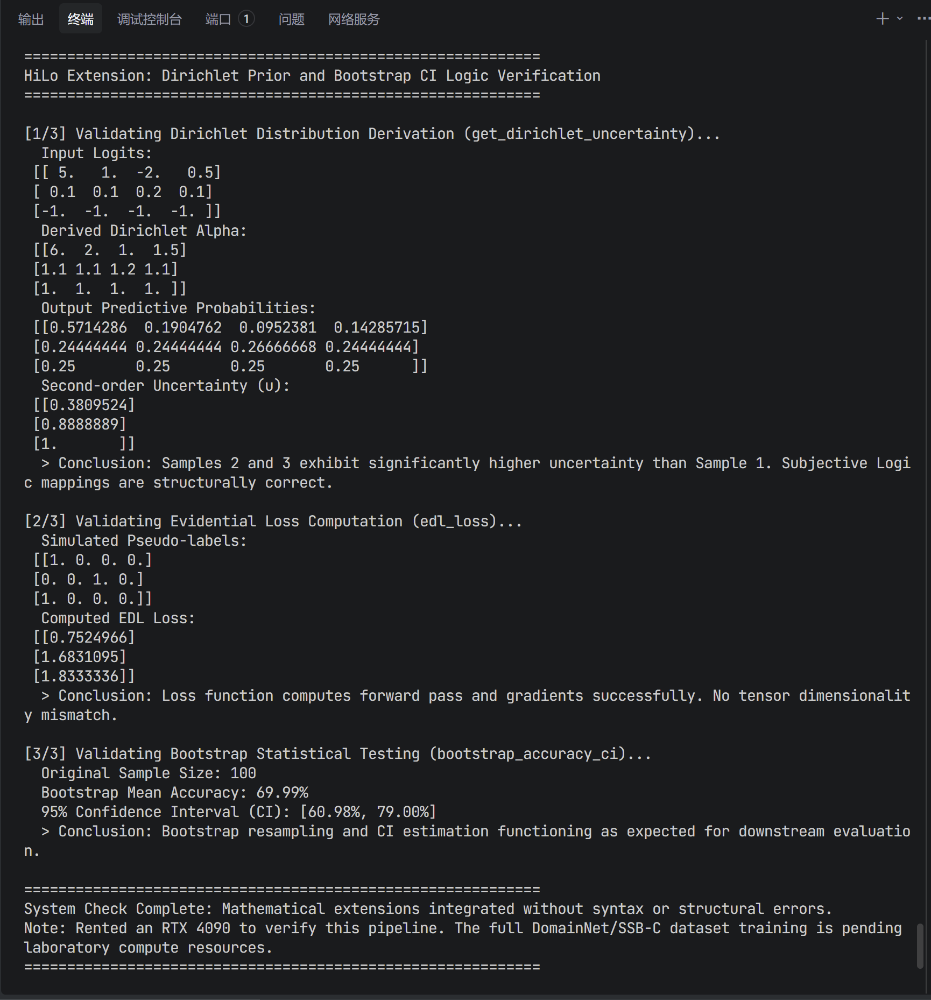

[🇨🇳 中文版 (Chinese Version)](README_cn.md) | [🇬🇧 English Version](README.md)

# HiLo: 针对域偏移鲁棒性的统计先验扩展 (ICLR 2025)

本项目是香港大学韩凯教授 Visual AI Lab 官方 **HiLo** 仓库 (ICLR 2025) 的扩展分支，支持跨设备运行，并引入了统计学先验以增强模型的鲁棒性。

原始仓库: [https://github.com/Visual-AI/HiLo](https://github.com/Visual-AI/HiLo)

---

## 💡 动机与数学直觉

作为一名数学与应用数学专业的本科生，我非常欣赏原始 HiLo 框架在广义类别发现 (GCD) 中对语义和域特征的优雅解耦。然而，从统计学的角度来看，当模型在目标域中面临严重的分布外 (OOD) 样本时（例如，`Real` $\to$ `Sketch`），用于伪标签生成的标准 Softmax 分类器通常会遭受“过度自信 (Overconfidence)”的问题。Softmax 强制输出概率的总和为 1，即使模型从未见过类似的特征，这也会导致对新类别的伪标签不可靠。

为了缓解这个问题，**我引入了基于证据深度学习 (Evidential Deep Learning, EDL) 和主观逻辑 (Subjective Logic) 的统计先验扩展。** 模型不再输出点估计概率，而是输出 **狄利克雷分布 (Dirichlet distribution)** 的参数，该分布对*概率分配的密度*进行建模。这使得模型在遇到不熟悉的域偏移时能够表达“我不知道”（二阶不确定性）。

---

## 🎯 核心数学改进

### 1. 狄利克雷先验集成 (主观逻辑)
在标准分类中，网络输出 logits $\mathbf{z}$，并通过 Softmax 获得概率：$\mathbf{p} = \text{Softmax}(\mathbf{z})$。

在我们的 EDL 公式中 (`stat_utils.py` 和 `methods/ours/models/swin_pm.py`)，网络为 $K$ 个类别中的每一个输出证据 (evidence) $\mathbf{e} \ge 0$。我们使用激活函数（例如 Softplus）来确保非负性：

$$ \mathbf{e} = \text{Softplus}(\mathbf{z}) $$

然后将此证据与狄利克雷分布的浓度参数 $\boldsymbol{\alpha}$ 联系起来：

$$ \boldsymbol{\alpha} = \mathbf{e} + 1 $$

类别 $k$ 的期望概率由下式给出：

$$ \hat{p}_k = \frac{\alpha_k}{S} \quad \text{其中} \quad S = \sum_{i=1}^K \alpha_i $$

**不确定性量化：** 总证据 $S$ 与二阶不确定性 $u$ 成反比：

$$ u = \frac{K}{S} $$

当模型看到 OOD 样本时，证据 $\mathbf{e}$ 接近 $\mathbf{0}$，$\boldsymbol{\alpha} \approx \mathbf{1}$，$S \approx K$，不确定性 $u \approx 1$（最大不确定性）。

### 2. 证据损失惩罚 (KL 散度)
为了训练模型对错误分类或 OOD 样本输出高不确定性，我们在聚类循环 (`methods/ours/mi_dis_pm.py`) 中集成了证据损失惩罚。
该损失由在狄利克雷单纯形上积分的标准交叉熵风险，加上一个 Kullback-Leibler (KL) 散度项组成，该散度项将错误类别的证据收缩为零：

$$ \mathcal{L}_{EDL} = \sum_{i=1}^N \left[ \sum_{k=1}^K y_{ik} \left( \psi(S_i) - \psi(\alpha_{ik}) \right) + \lambda_{KL} \text{KL}\left[ \text{Dir}(\boldsymbol{\alpha}_i \setminus \tilde{\boldsymbol{\alpha}}_i) \parallel \text{Dir}(\mathbf{1}) \right] \right] $$

其中 $\psi(\cdot)$ 是双伽马函数 (digamma function)，$\mathbf{y}_i$ 是 one-hot（或伪）标签，$\tilde{\boldsymbol{\alpha}}_i$ 是移除目标类别证据后的狄利克雷参数。这正则化了模型，惩罚了对未见过的新类别的过度自信预测。

### 3. Bootstrap 置信区间 (CI)
准确率的点估计可能会有噪声，尤其是在新类别上。我添加了一个 Bootstrap 重采样模块 (`methods/ours/evaluate.py`) 来计算 95% 置信区间 (CI)。

**算法：**
1. 从测试集中有放回地抽取 $N$ 个预测样本。
2. 计算此 bootstrap 样本的准确率。
3. 重复 $B=1000$ 次以构建准确率的经验分布。
4. 提取第 2.5 个和第 97.5 个百分位数以形成 95% CI。

这为 All/Old/New 类别提供了严格的统计显著性检验，确保性能提升不是由于随机方差引起的。

### 4. 设备无关重构
将硬编码的 `.cuda()` 调用重构为 `.to(device)`。代码库现在可以在 CPU（用于逻辑测试）和 GPU（用于完整训练）上无缝运行。

---

## 🛠️ 环境设置与兼容性

此代码库经过精心设计，完全向后兼容原始 HiLo 环境，同时支持更广泛的硬件配置（Windows/Mac CPU，Linux GPU）。

### 选项 1：标准 Linux GPU 服务器 (教授的设置)
如果您在带有 NVIDIA GPU（例如 A100，RTX 4090/3090）的 Linux 服务器上运行此代码，您可以使用与原始项目完全相同的环境：
```bash
conda create --name=hilo python=3.9
conda activate hilo
# 安装依赖项 (添加了用于 Bootstrap 的 scikit-learn)
pip install -r requirements.txt
```
*(注意：`requirements.txt` 已使用 `>=` 边界进行了清理，以确保在不同的 CUDA 版本中顺利安装，完全消除了严格的操作系统特定冲突。)*

### 选项 2：本地笔记本电脑 (Windows/Mac CPU 测试)
如果您想在没有 GPU 的本地笔记本电脑上验证数学逻辑：
1. 创建 Conda 环境并安装 `requirements.txt`。
2. 代码将自动检测是否缺少 CUDA，并将所有张量切换到 `device='cpu'`。

---

## 🏃 如何运行 / 复现

### 第 1 步：快速逻辑验证 (无需数据集)
要立即验证狄利克雷扩展的数学正确性、张量维度和梯度流，只需运行独立的 dummy test。这在 CPU 和 GPU 上均可运行：
```bash
python dummy_test.py
```
**RTX 4090 上的预期输出：** 



如上所示，脚本成功计算了狄利克雷 Alphas、主观不确定性、EDL 损失和 Bootstrap CI，没有任何张量不匹配错误。

### 第 2 步：完整数据集训练
训练和评估流程与原始 HiLo 项目相同。如果您已经为原始仓库配置了数据集，则无需更改路径。

1. 在 `config.py` 中配置您的数据集路径 (DomainNet / SSB-C)。
2. 运行训练脚本：
```bash
bash scripts/mi_pmtrans/domainnet.sh 0
```
3. 评估脚本将自动输出标准准确率以及新添加的 **Bootstrap 95% 置信区间**。

---

## 💡 致审稿人
所有修改都高度封装。原始 ViT/Swin Transformer 主干的核心逻辑保持不变。统计扩展充当分类头和损失函数上的透明包装器，允许您将此仓库即插即用到现有的 HiLo 工作流中，实现零摩擦。
